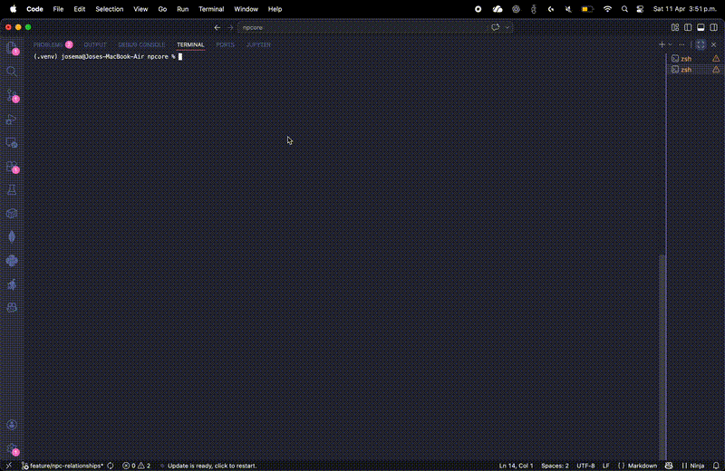

# NPCore

> Framework de simulación de NPCs con inteligencia emergente, comportamiento social y toma de decisiones adaptativa.

**npcore** es una librería en Python para simular NPCs (Non-Player Characters) inteligentes en entornos dinámicos.  
Permite modelar comportamiento autónomo mediante reglas, memoria, emociones, aprendizaje, interacción social y navegación espacial.

---

## Demo de simulación

Ejemplo de simulación completa:

---

## Tutorial en Google Colab

---

## Descripción

npcore implementa un sistema de agentes donde cada NPC toma decisiones en función de su estado, su contexto y múltiples factores internos como prioridades, emociones, memoria y objetivos.

Además, los NPCs interactúan entre sí dentro de un entorno dinámico que soporta:

- eventos globales
- proximidad entre agentes
- estructuras sociales
- comportamiento grupal

El sistema sigue una arquitectura modular y extensible que permite evolucionar hacia modelos más avanzados como:

- Utility AI
- aprendizaje adaptativo
- simulaciones multi-agente complejas

---

## Instalación

Instala la librería directamente con pip:

 bash
 pip install npcore

---

## En google colab
!pip install npcore

--

## Uso básico
from npcore.brain import Brain
from npcore.npc import NPC
from npcore.environment import Environment

brain = Brain()

def idle_rule(context):
    return {"run": 1.0, "wait": 1.0}

brain.add_rule("idle", idle_rule)

npc = NPC("Guard", brain)
npc.set_state("idle")

env = Environment(width=8, height=6)
env.add_npc(npc)

env.run(steps=5)

print(env.summary())

---

## Características principales

Sistema de decisiones
	•	Motor de reglas (Brain)
	•	Soporte para reglas:
	•	rule(context)
	•	rule(npc, context)
	•	Selección probabilística de acciones

Memoria y aprendizaje
	•	Memoria estructurada de eventos
	•	Prioridad de memoria
	•	Aprendizaje basado en resultados
	•	Ajuste dinámico de decisiones

Personalidad y emociones
	•	Traits: agresión, sociabilidad, miedo, lealtad
	•	Estados emocionales que afectan decisiones

Interacción social
	•	Relaciones entre NPCs
	•	Comunicación entre aliados
	•	Sistema de órdenes (líder → grupo)
	•	Compartición de objetivos y prioridades

Comportamiento grupal
	•	Seguimiento de líder
	•	Reagrupamiento
	•	Coordinación de destino
	•	Reacción a eventos compartados

Movimiento y entorno
	•	Pathfinding con A*
	•	Obstáculos en el mapa
	•	Zonas con costos de movimiento
	•	Evaluación de riesgo local
	•	Movimiento hacia objetivos

Sistema de eventos
	•	Eventos globales y locales
	•	Reacciones basadas en reglas
	•	Integración con el entorno

Visualización
	•	Render ASCII del entorno
	•	Visualización con matplotlib
	•	Simulación paso a paso

Narrativa
	•	Generación automática de historia
	•	Resumen estructurado de simulación

---

## Arquitectura
NPC → Brain → Rules → Probabilities → Decision
Las decisiones son modificadas dinámicamente por:
	•	emociones
	•	prioridades
	•	objetivos
	•	aprendizaje (experiencias pasadas)

Esto permite un comportamiento flexible, adaptativo y emergente.

---

## Estructura del proyecto
src/npcore/
    brain.py
    npc.py
    environment.py
    pathfinding.py
    probability.py
    story_engine.py

tests/
    test_npc.py
    test_environment.py
    test_probability.py

examples/
    demo_simple.py
    demo_interaction.py
    demo_simulation.py

notebooks/
    tutorial_npcore.ipynb

docs/
    demo.gif
