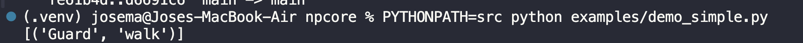
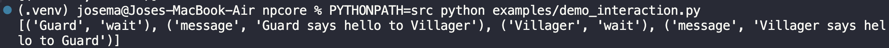
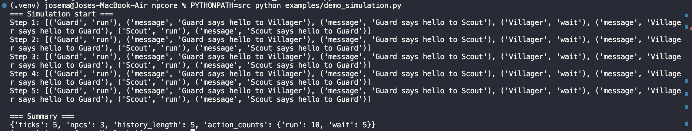

# NPCore

NPCore es una librería en Python para la simulación de agentes (NPCs) con toma de decisiones basada en reglas, contexto, emociones, objetivos y estructuras sociales. El proyecto está diseñado como una base modular y extensible para sistemas de inteligencia artificial en simulaciones o videojuegos.


## Tutorial en Google Colab

[](https://colab.research.google.com/github/Hotzh3/npcore/blob/main/notebooks/tutorial_npcore.ipynb)
---

## Descripción

NPCore implementa un sistema de agentes donde cada NPC toma decisiones en función de su estado, su contexto y múltiples factores internos como prioridades, emociones y objetivos. Además, los NPCs interactúan entre sí dentro de un entorno que soporta eventos y proximidad.

El sistema sigue una arquitectura clara y escalable que permite evolucionar hacia modelos más avanzados como Utility AI, aprendizaje dinámico o simulaciones complejas multi-agente.

---

## Características principales

- Motor de decisiones modular (`Brain`)
- Soporte para reglas en dos formatos:
  - `rule(context)`
  - `rule(npc, context)`
- NPCs con:
  - estado y contexto dinámico
  - memoria (recordar, recuperar y olvidar información)
  - objetivos (goals)
  - prioridades
  - emociones (como miedo y agresión)
  - grupo y jerarquía social (rango)
- Sistema de entorno (`Environment`):
  - ejecución por pasos (simulation loop)
  - eventos globales
  - detección de proximidad
  - interacción entre NPCs
- Influencia social entre agentes
- Integración de emociones y objetivos en la toma de decisiones
- Sistema de aprendizaje básico basado en resultados previos
- Normalización de probabilidades en decisiones
- Tests automatizados con pytest

---
## Arquitectura

El flujo principal del sistema es el siguiente:

NPC -> Brain -> Rules -> Probabilities -> Decision

Dentro del Brain, las probabilidades son modificadas por:

- prioridades del NPC
- emociones
- objetivos

Esto permite una toma de decisiones flexible y extensible.

---

## Instalación
Dentro del `Brain`, las decisiones son modificadas por:

- prioridades del NPC
- emociones
- objetivos
- aprendizaje (experiencias pasadas)

Esto permite una toma de decisiones flexible, dinámica y extensible.

---

## Instalación

```bash
git clone https://github.com/Hotzh3/npcore.git
cd npcore
pip install -e .

## Uso básico
  from npcore.brain import Brain
  from npcore.npc import NPC
  from npcore.environment import Environment

  brain = Brain()

  def idle_rule(context):
      return {"walk": 0.5, "rest": 0.5}

  brain.add_rule("idle", idle_rule)

  npc = NPC("Guard", brain)
  npc.set_state("idle")

  env = Environment()
  env.add_npc(npc)

  results = env.step()
  print(results)

## Ejemplo con interacción entre NPCs
  npc1 = NPC("Guard", brain)
  npc2 = NPC("Villager", brain)

  npc1.set_state("idle")
  npc2.set_state("idle")

  npc1.set_position(0, 0)
  npc2.set_position(1, 0)

  env = Environment()
  env.add_npc(npc1)
  env.add_npc(npc2)

  results = env.step()

## Para ejecutar todos los test
  pytest --cache-clear

## Estructura del proyecto
  src/npcore/
      brain.py
      npc.py
      environment.py
      probability.py
      utility.py

  tests/
      test_npc.py
      test_environment.py
      test_probability.py

  examples/
      demo_simple.py
      demo_interaction.py
      demo_simulation.py

  assets/
      demo_simple.png
      demo_interaction.png
      demo_simulation.png
      tests.png

## Ejecución

### Demo simple


### Demo interacción


### Tests


### Demo simulación completa

